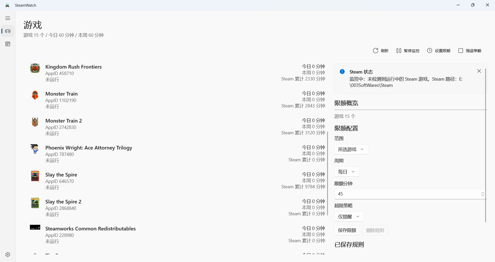

# SteamWatch.WinUI

SteamWatch 是一个 Windows 桌面工具，用于监控 Steam 游戏运行时间，并在接近或超过限额时提醒用户，必要时可以倒计时后尝试关闭游戏进程。



## 给使用者

### 主要功能

- 自动读取 Steam 已安装游戏。
- 显示游戏图标、今日游玩时长、本周游玩时长和 Steam 累计时长。
- 支持为全部游戏或单个游戏设置每日/每周限额。
- 支持两种超限策略：
  - 仅提醒：系统通知、程序内弹窗和声音提醒。
  - 强制退出：倒计时提醒后尝试关闭对应游戏进程。
- 支持托盘图标、暂停/恢复监控、关闭到托盘。
- 支持自定义提醒阈值和强退倒计时。
- 启动时可根据 Steam 累计时长补记未开启 SteamWatch 期间的游玩时间。
- 可开启认证保护，修改限额规则、保存设置和退出应用前需要输入密码。

### 下载和启动

发布包通常提供两种形式：

- 安装器版：运行 `SteamWatchSetup-win-x64.exe` 安装。安装完成后从桌面或开始菜单启动。
- 绿色版：解压 `SteamWatch-win-x64.zip`，进入 `SteamWatch-win-x64` 文件夹，运行 `SteamWatch.exe`。

绿色版目录中的 `.dll`、`.json`、`Assets`、`runtimes` 等文件都是程序运行所需文件，不要单独删除。

### 使用建议

SteamWatch 需要和 Steam 安装数据配合工作。一般情况下，Steam 先启动或 SteamWatch 先启动都可以；如果游戏列表或图标没有立即刷新，可以在 SteamWatch 中点击刷新。

SteamWatch 运行时会按分钟记录游玩时间。未开启 SteamWatch 期间的游玩时间会在下次启动时通过 Steam 累计时长差值补记到当天；如果跨天游玩后才启动，Steam 本地缓存无法提供精确日期，补记不会拆分到历史日期。

认证保护用于减少用户从应用内绕过规则的可能。开启后，修改限额规则、保存设置和退出 SteamWatch 都需要输入密码。它不能阻止通过任务管理器结束进程、删除本地数据文件或卸载程序这类系统级操作。

全屏游戏时，Windows 可能自动开启勿扰模式，导致系统通知不显示。建议按以下步骤关闭相关自动规则：

1. 按 `Win + I` 打开 Windows 设置。
2. 进入 `系统` -> `通知`。
3. 确保顶部 `勿扰模式` 处于关闭状态。
4. 展开 `自动打开勿扰模式`。
5. 取消勾选 `玩游戏时`。
6. 取消勾选 `在全屏模式下使用应用时`。

更完整的中文说明见 [docs/manual-zh.txt](docs/manual-zh.txt)。

### 数据保存

SteamWatch 会在运行目录下的 `data/` 文件夹保存设置、限额规则和本地游玩记录。迁移绿色版时，可以一并复制 `data/` 文件夹。

## 给开发者

### 技术栈

- .NET 10
- WinUI 3 / Windows App SDK
- MSTest
- Windows Forms NotifyIcon，用于托盘图标

项目目标框架：

- 应用：`net10.0-windows10.0.26100.0`
- 最低 Windows 平台：`10.0.19041.0`
- 主要发布平台：`win-x64`

### 项目结构

```text
SteamWatch.WinUI/
  src/
    SteamWatch.App/             WinUI 3 桌面应用
    SteamWatch.Core/            领域逻辑、限额、提醒、统计
    SteamWatch.Infrastructure/  Steam 读取、存储、进程关闭等基础设施
    SteamWatch.Installer/       自包含安装器
  tests/
    SteamWatch.Tests/           MSTest 单元测试
  scripts/
    publish-portable.ps1        生成绿色版 ZIP
    build-installer.ps1         生成绿色版 ZIP 和安装器 EXE
  docs/
    manual-zh.txt               中文操作指南
    manual-acceptance.md        手工验收说明
  assets/                       应用图标源文件
```

### 本地构建

```powershell
dotnet build .\src\SteamWatch.App\SteamWatch.App.csproj -c Debug -p:Platform=x64
```

### 运行测试

```powershell
dotnet test .\SteamWatch.slnx
```

### 生成发布包

生成绿色版 ZIP：

```powershell
powershell -ExecutionPolicy Bypass -File .\scripts\publish-portable.ps1 -Configuration Release -Platform x64
```

生成绿色版 ZIP 和安装器：

```powershell
powershell -ExecutionPolicy Bypass -File .\scripts\build-installer.ps1 -Configuration Release -Platform x64
```

构建产物会生成到：

- `dist/SteamWatch-win-x64.zip`
- `dist/SteamWatchSetup-win-x64.exe`

`dist/`、`artifacts/`、`bin/`、`obj/`、`data/` 等目录不提交到仓库。二进制发布包建议上传到 GitHub Releases。

### GitHub 上传

如果本地还没有配置远端：

```powershell
git remote add origin https://github.com/lyclycNSP/SteamWatch.WinUI.git
```

提交并推送：

```powershell
git add .
git commit -m "Prepare SteamWatch WinUI release"
git branch -M main
git push -u origin main
```

如果远端已经有提交，推送前先拉取并处理差异。
